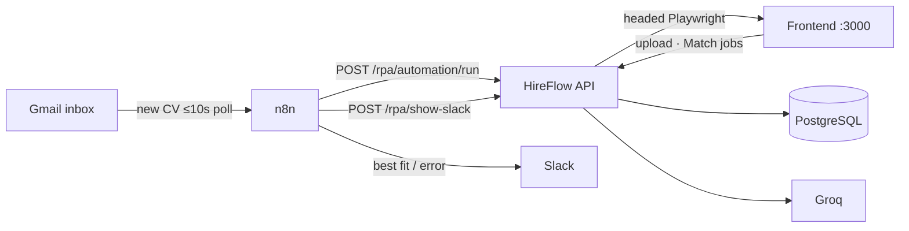
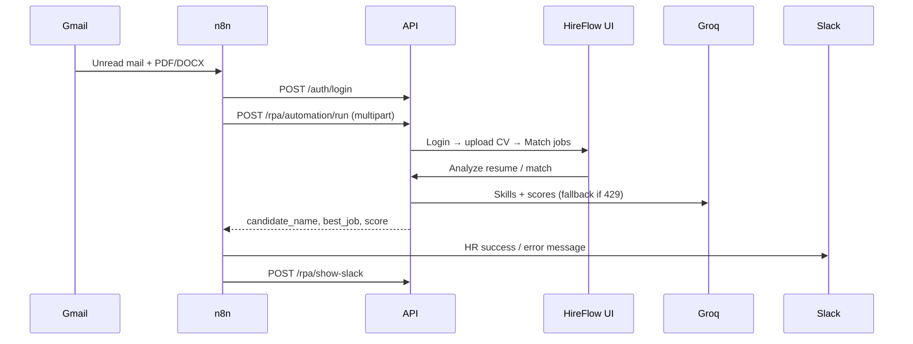
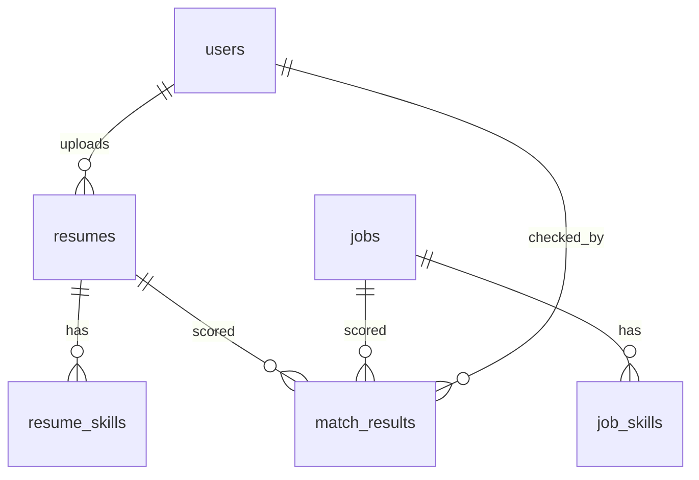
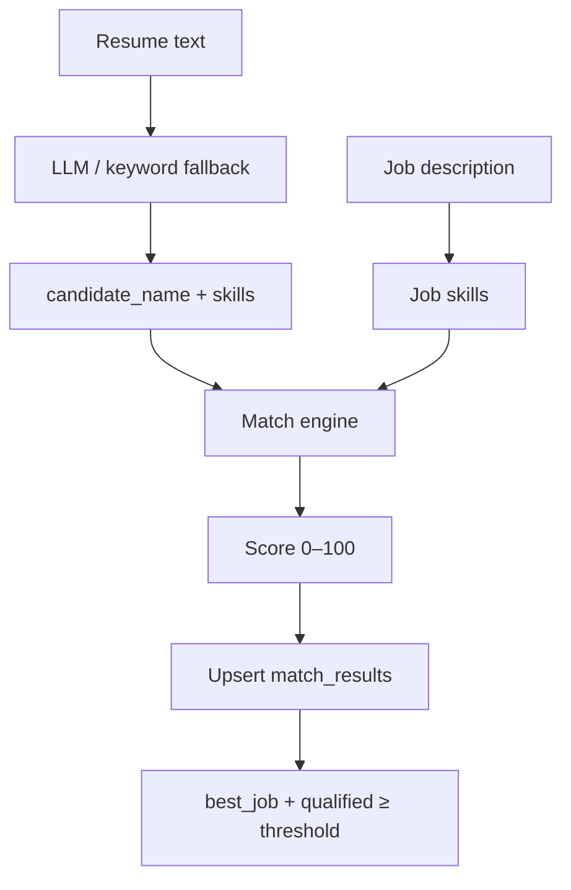
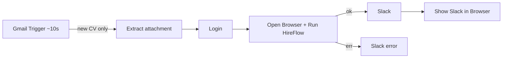

# HireFlow AI Backend

AI hiring pipeline: **Gmail CV → n8n → visible browser RPA → FastAPI + Groq → Slack HR alert**.

Staff upload/match via API or UI; inbox automation drives a headed Playwright session on the HireFlow frontend so screening is visible end-to-end.

**Stack:** FastAPI · PostgreSQL · Alembic · JWT · Groq · Playwright · n8n · Gmail · Slack

---

## System overview





---

## Domain model





---

## Features

| Area | What it does |
|------|----------------|
| Auth | JWT — **admin** (users + settings) / **hr** (staff APIs) / **user** (career portal) |
| Resumes | PDF/DOCX upload → parse → skills + candidate name |
| Jobs | Create + auto skill analysis |
| Match | Score vs all jobs; cache; `?force=true`; admin threshold |
| RPA | Visible browser: login → upload → match; then Slack tab |
| Resilience | Groq `429` → keyword / skill-overlap fallbacks |
| n8n | Gmail Trigger (~10s silent poll) → RPA → Slack |

---

## Quick start

```bash
python -m venv .venv && source .venv/bin/activate
pip install -r requirements.txt
# optional RPA extras:
pip install -r scripts/requirements-rpa.txt && playwright install chromium

cp .env.example .env   # DATABASE_URL, SECRET_KEY, GROQ_API_KEY, HF_* 
alembic upgrade head
uvicorn app.main:app --reload --host 127.0.0.1 --port 8000
```

| Check | URL |
|-------|-----|
| OpenAPI | http://127.0.0.1:8000/docs |
| Health | `GET /api/v1/health` |

First admin (once): `POST /api/v1/auth/register-admin`

Frontend (separate repo) should be on `HF_BASE_URL` (default `http://localhost:3000`) with the same staff login as `HF_EMAIL` / `HF_PASSWORD`.

## Docker (recommended)

**One-time setup:**

```bash
cp .env.example .env
# Edit .env: DATABASE_URL (pgAdmin credentials), SECRET_KEY, GROQ_API_KEY, HF_*
chmod +x start.sh
```

**Every day — start the backend:**

```bash
docker compose up -d
# or
./start.sh
```

**After you change backend code:**

```bash
docker compose up --build -d
# or
./start.sh --build
```

**With n8n automation:**

```bash
./start.sh --n8n
# or: docker compose --profile automation up -d
```

**With visible RPA browser (Linux desktop):**

```bash
./start.sh --rpa --build
```

| Service | URL |
|---------|-----|
| API / OpenAPI | http://localhost:8000/docs |
| Health | `GET /api/v1/health` |
| Frontend | http://localhost:3000 (separate repo, `npm run dev`) |
| pgAdmin | Host `localhost`, port `5432`, DB `hireflow_db` |
| n8n | http://localhost:5678 (with `--profile automation`) |

The API uses your **local PostgreSQL** via `DATABASE_URL` in `.env` (`127.0.0.1:5432`). Migrations run automatically on start. Uploaded files are stored in a Docker volume.

Optional: if you do not have PostgreSQL on the host, start the bundled DB with `docker compose --profile bundled-db up -d` and point `DATABASE_URL` at port `5433`.

### Show the RPA browser on Linux

The API logs shown as `api-1` mean the RPA runs *inside Docker*. A browser can only appear on your desktop when it is headed and allowed to use the host X11 display:

```bash
# Or use the helper script (runs xhost +local: automatically when RPA is headed):
./start.sh --rpa --build

# Ensure .env contains:
# RPA_ENABLED=true
# RPA_HEADLESS=false
# DISPLAY=:0
# HF_EMAIL=your-staff-login
# HF_PASSWORD=your-staff-password
# HF_BASE_URL=http://localhost:3000
docker compose up -d
```

The Compose file mounts `/tmp/.X11-unix` and passes `DISPLAY` into the API container. The frontend can stay outside Docker: because the API has host networking, set `HF_BASE_URL=http://localhost:3000`. This is suitable for a local demo machine; run `xhost -local:` afterwards to remove the temporary X11 permission. For Wayland-only desktops or production deployments, run the API/RPA process directly on the desktop host (or keep `RPA_HEADLESS=true`) instead.

---

## Environment

See [`.env.example`](.env.example). Important keys:

| Key | Purpose |
|-----|---------|
| `DATABASE_URL` | PostgreSQL |
| `SECRET_KEY` | JWT signing |
| `GROQ_API_KEY` | LLM |
| `GROQ_MODEL` | Groq chat model (default `openai/gpt-oss-120b`) |
| `RPA_ENABLED` | Enable `/rpa/*` |
| `HF_EMAIL` / `HF_PASSWORD` | UI login for Playwright |
| `HF_BASE_URL` | Frontend origin |
| `SLACK_CHANNEL_URL` | Optional Slack tab after notify |
| `RPA_SLOW_MO_MS` / `RPA_HEADLESS` | Browser pace / headless |

Never commit `.env`.

---

## API (`/api/v1`) — Bearer JWT unless noted

| Area | Endpoints |
|------|-----------|
| Auth | `POST /auth/login` · `POST /auth/register-admin` (public, once) |
| User Career | `POST /user-career/register-user` (public) · `POST /user-career/upload-cv` / `GET /user-career/resumes` (user JWT) · `POST /user-career/resumes/{id}/evaluate?option=existing_jobs` (HR-created jobs >60%) or `option=ai_career` (AI career advice) · `POST /user-career/chat` (private career coach) |
| Resumes | `POST /resumes/upload` · `GET /resumes` · `GET /resumes/{id}` |
| Jobs | `POST /jobs` · `GET /jobs` · `GET\|DELETE /jobs/{id}` · `POST /jobs/{id}/analyze` |
| Match | `POST /match/{resume_id}` · `POST /match/{resume_id}/{job_id}` · `GET /match` · `GET /match/by-resume\|by-job/{id}` |
| Admin | `POST\|GET\|DELETE /admin/users` (HR) · `POST\|GET\|DELETE /admin/career-users` (career accounts; `GET /{id}` supported) · `GET\|PUT /admin/settings` |
| RPA | `POST /rpa/automation/run` · `POST /rpa/show-slack` |

Match payload highlights: `candidate_name`, `best_job`, `qualified_jobs`, `score_threshold`.  
Settings: `PUT /admin/settings` → `{ "match_score_threshold": 70 }`.

---

## n8n automation

**Preferred workflow:** [`n8n/hireflow-mail-visible-rpa.json`](n8n/hireflow-mail-visible-rpa.json)



| Behavior | Detail |
|----------|--------|
| Trigger | Gmail Trigger — silent poll; **execution only when mail matches** |
| Latency | Poll ticks `:00,:10,:20,:30,:40,:50` → start within ~10s |
| Filter | Unread + attachment (`pdf` / `docx` / `doc`) |
| Slack eligibility | One message for the single highest job match only when its score is ≥60%; below 60% sends no success Slack message |
| Name on Slack | Scraped HireFlow name; UUID filenames rejected |
| Legacy | [`n8n/hireflow-resume-automation.json`](n8n/hireflow-resume-automation.json) = API-only (no browser) |

Import → attach Gmail OAuth + Slack → set Login body to a real staff user → **Publish** + activate. Inbox only (not Spam).

Local n8n: `npx n8n` → http://localhost:5678

---

## Layout

```text
app/
  api/v1/endpoints/   # auth, resumes, jobs, match, admin, rpa
  services/           # llm, matching, rpa_browser, analyzers
  models/ repositories/ schemas/ prompts/
alembic/              # migrations
n8n/                  # workflow JSON exports
scripts/              # optional RPA helpers / demos
uploads/              # runtime files (gitignored)
```

---

## Troubleshooting

| Issue | Fix |
|-------|-----|
| `401` | Re-login; `Authorization: Bearer …` |
| Groq `429` | Pipeline keeps going via fallbacks; wait or upgrade quota |
| No `/rpa/automation/run` line in API logs | Re-import the updated workflow and activate it; local n8n calls `localhost:8000` |
| RPA disabled | `RPA_ENABLED=true` + valid `HF_*` |
| Browser does not appear | `RPA_HEADLESS=false`, run `xhost +local:`, then recreate the API container; see **Show the RPA browser on Linux** |
| Browser blank / wrong host | Frontend up; `HF_BASE_URL` matches |
| Slack shows UUID name | Re-run with published RPA workflow; name comes from UI extract |
| n8n “poll too short” | Don’t use `*/10 * * * * *`; use `0,10,20,30,40,50 * * * * *` |
| Workflow runs every 10s empty | Use **Gmail Trigger**, not Schedule Trigger |
| Spam ignored | Move mail to Inbox |
| Score ~0 | `POST /jobs/{id}/analyze` |

Prefer HTTPS + strong secrets in production.
