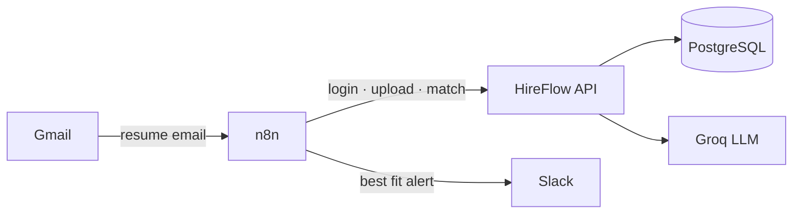
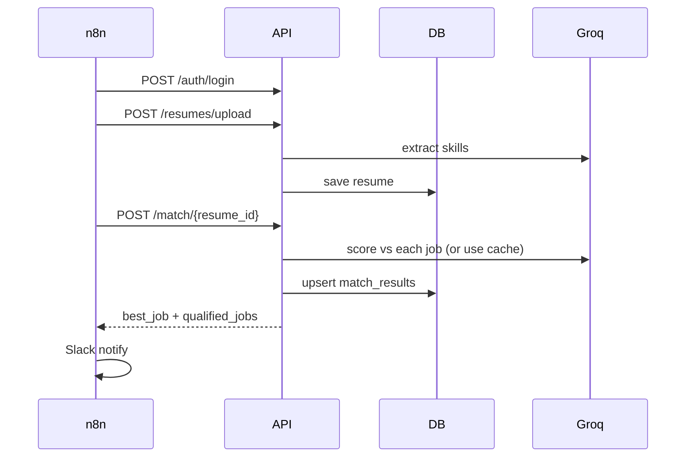
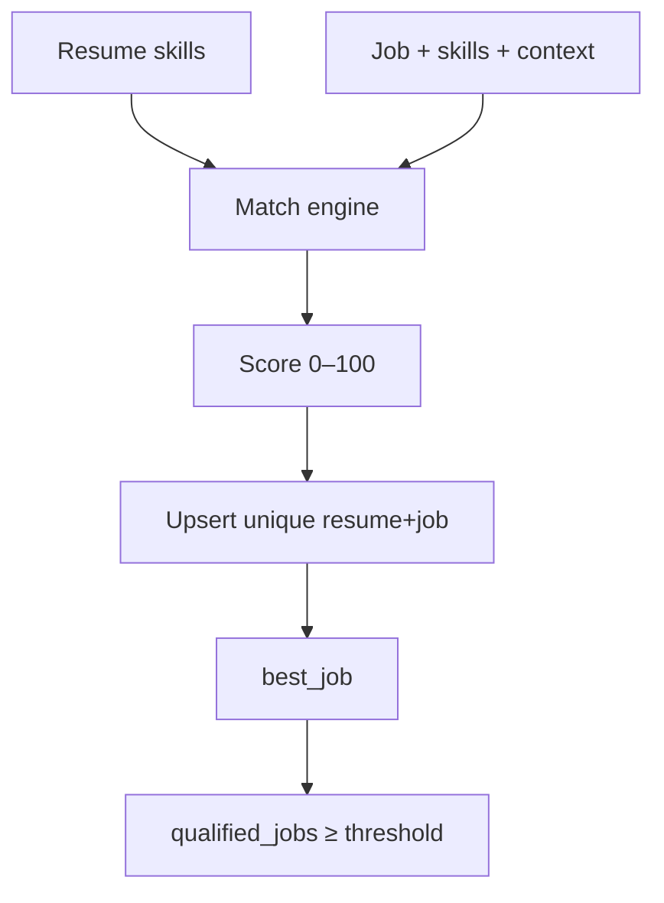
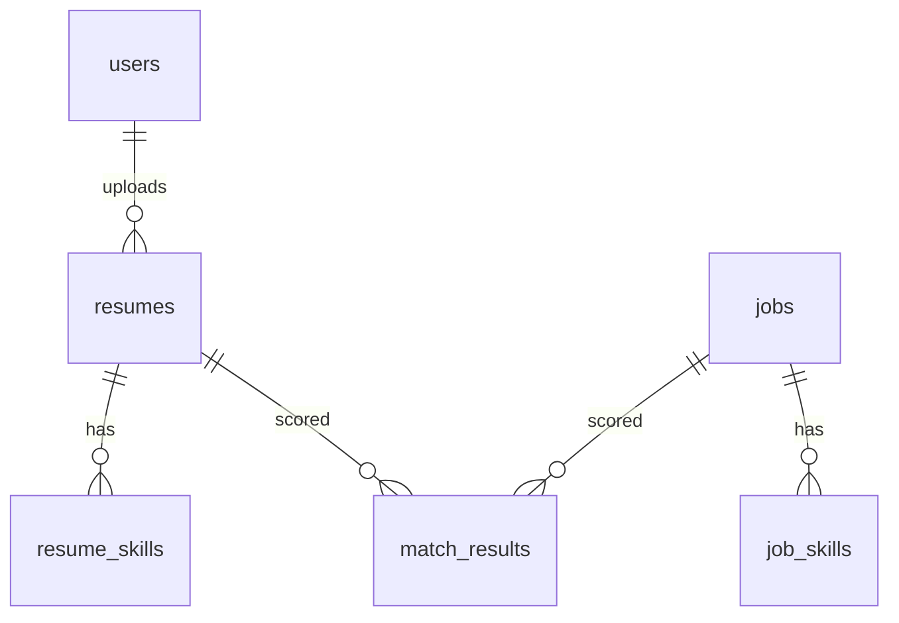
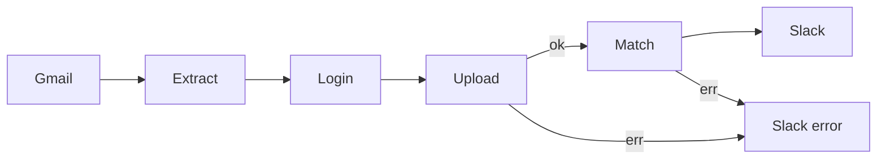

# HireFlow AI Backend

FastAPI + PostgreSQL + Groq hiring assistant: resume ingest → skill extract → match all jobs → Slack HR alert (via n8n).

**Stack:** FastAPI · PostgreSQL · Alembic · JWT · Groq · n8n · Slack · Gmail

---

## Architecture









---

## Features

- JWT auth — **admin** (all + settings write) / **hr** (staff APIs)
- Resume upload (PDF/DOCX) → parse → skills + candidate name
- Jobs auto-analyze skills on create
- Domain-aware LLM match across **all** jobs; upsert; cache unless `?force=true`
- Admin `match_score_threshold`; Groq `429` when rate-limited
- n8n: Gmail → API → Slack (+ error path)

---

## Quick start

```bash
python -m venv .venv && source .venv/bin/activate
pip install -r requirements.txt
cp .env.example .env   # set DATABASE_URL, SECRET_KEY, GROQ_API_KEY
alembic upgrade head
uvicorn app.main:app --reload
```

Docs: `/docs` · Health: `GET /api/v1/health`  
First admin: `POST /api/v1/auth/register-admin` (once only)

---

## API (`/api/v1`) — Bearer JWT (staff unless noted)

| Area | Endpoints |
|------|-----------|
| Auth | `POST /auth/login` · `POST /auth/register-admin` (public*) |
| Resumes | `POST /resumes/upload` · `GET /resumes` · `GET /resumes/{id}` |
| Jobs | `POST /jobs` · `GET /jobs` · `GET|DELETE /jobs/{id}` · `POST /jobs/{id}/analyze` |
| Match | `POST /match/{resume_id}` (all jobs) · `POST /match/{resume_id}/{job_id}` · `GET /match` · `GET /match/by-resume|by-job/{id}` |
| Admin | `CRUD /admin/users` (admin) · `GET|PUT /admin/settings` |

Auto-match returns `candidate_name`, `score_threshold`, `best_job`, `qualified_jobs`.  
Settings: `PUT /admin/settings` → `{ "match_score_threshold": 70 }`

---

## n8n

File: [`n8n/hireflow-resume-automation.json`](n8n/hireflow-resume-automation.json)



Import JSON → Gmail + Slack credentials → real login in **Login HireFlow** → publish. Inbox only (not Spam). Calls: login → upload → `POST /match/{resume_id}`.

---

## Layout

```text
app/api · core · models · prompts · repositories · schemas · services
alembic/ · n8n/ · uploads/resumes/
```

---

## Troubleshooting

| Issue | Fix |
|-------|-----|
| `401` | Re-login; send `Authorization: Bearer …` |
| `429` Groq | Wait / upgrade; avoid `force=true` spam |
| n8n error Slack | Check Executions + API logs |
| Spam ignored | Move mail to Inbox |
| Score ~0 | `POST /jobs/{id}/analyze` |

Keep `.env` private. Prefer HTTPS in production.
